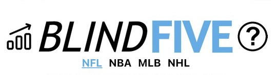
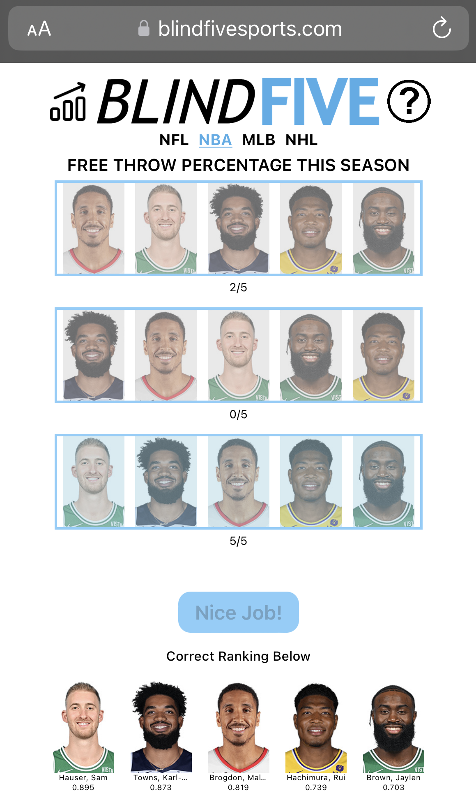

<p align="center">
  
</p>

Blind Five is a daily sports challenge game that tests your knowledge of player statistics across the NBA and NFL.  
Every day at midnight EST, a new stat and a new pool of players are selected. Your goal: **rank 5 players from highest to lowest in that stat**.  

Data is sourced directly from [Sports-Reference.com](https://www.sports-reference.com/), scraped daily to ensure fresh and accurate stats.

---

## Table of Contents
- [How to Play](#how-to-play)
- [Screenshots](#screenshots)
- [How It Works](#how-it-works)
- [Server Endpoints](#server-endpoints)
- [Key Code Explained](#key-code-explained)
- [Daily Data Refresh](#daily-data-refresh)
- [Installation](#installation)
- [Data Source Disclaimer](#data-source-disclaimer)
- [Future Roadmap](#future-roadmap)
  
---

## How to Play

- You are given **THREE** attempts to rank the **FIVE** players from highest to lowest with respect to a statistic.  
- Click a player at the bottom to select them.  
- Click an empty box above to rank the player.  
- Example: If the stat of the day is *POINTS*, rank the players by total points for the current or most recent season.

Additional rules and behavior:
- If two are correct, you will see `2/5`.  
- You will not know which players are correct, only how many are correct.  
- Players' stats are based only on the current or most recent season.  
- The stat and players reset daily at **12:00 AM EST**.

Good luck!

---

## Screenshots

<p align="center">
  
</p>

---

## How It Works

Blind Five is powered by a daily data pipeline:

1. **Data Source**  
   Stats are fetched from [Sports-Reference.com](https://www.sports-reference.com/), which maintains detailed player and team statistics across major leagues.

2. **Daily Webscrape**  
   Using [Puppeteer](https://pptr.dev/), the system automatically loads the relevant HTML pages and tables from Sports-Reference once per day.

3. **Iterating HTML Tables**  
   The scraper extracts data from `<tbody>` rows and `<td>` cells. Each `<tr>` corresponds to a player, and specific `<td>` columns contain statistics such as points, yards, rebounds, or touchdowns. The scraper reads those cells, converts text to numbers when possible, and uses those values to form candidate pools.

4. **Filtering Candidates**  
   Players are filtered using configurable key stats. The scraper computes a per-player aggregate of key stats and uses an average threshold to filter out low-performing rows. This reduces noise and helps the daily picks be meaningful.

5. **Picking the Blind Five**  
   From the filtered candidate pool, five unique players are selected at random. The system also picks a stat type randomly for that day. The final payload contains player names, image links derived from Sports-Reference links, and the stat value.

6. **Serving Data**  
   The backend caches the daily selection in `allTodaysData.json` then serves it through REST endpoints for the front end to consume.

---

## Server Endpoints

The server is built with Express.js. It exposes endpoints for both NBA and NFL:

```js
// NBA endpoint
app.get('/nba', (req, res) => {
    if (req.headers.accept && req.headers.accept.includes('application/json')) {
        // send JSON payload to clients (API consumers)
        res.send(JSON.stringify(allSportOptions.nba.todaysData))
        usersToday.nba += 1
    } else {
        // send front-end HTML to browsers
        res.sendFile(path.join(__dirname, 'public', 'index.html'));
    }
})

// NFL endpoint
app.get('/nfl', (req, res) => {
    if (req.headers.accept && req.headers.accept.includes('application/json')) {
        res.send(JSON.stringify(allSportOptions.nfl.todaysData))
        usersToday.nfl += 1
    } else {
        res.sendFile(path.join(__dirname, 'public', 'index.html'));
    }
})
```

- If the client requests JSON, the API responds with the current daily challenge data.  
- Otherwise it serves the HTML front-end.

---

## Key Code Explained

### 1. Selecting Candidate Players

This snippet computes a per-player aggregate across configured key stats, computes the average across all rows, and returns indexes of players at or above average.

```js
async function generateBestCandidates(page, rows, sportInformation) {
    var candidatesIndex = []
    var totalKeyStatValues = 0
    var keyStatValueArray = []

    for (let i = 0; i < rows.length; i++) {
        let row = rows[i]
        var individualSumKeyStats = 0

        for (let j = 0; j < sportInformation.keyStats.length; j++) {
            let element = await row.$(`td:nth-child(${sportInformation.keyStats[j][0]})`)
            var value = 0
            try {
                var placeholder = parseInt(await page.evaluate(el => el.textContent, element))
                if (Number.isNaN(placeholder)) {
                    value = 0
                } else {
                    value = placeholder
                }
            } catch (error) {
                // missing or malformed cell, treat as zero
                value = 0
            }
            individualSumKeyStats += value
        }

        keyStatValueArray.push(individualSumKeyStats)
        totalKeyStatValues += individualSumKeyStats
    }

    const averageKeyStatValue = totalKeyStatValues / rows.length

    for (let i = 0; i < rows.length; i++) {
        if (keyStatValueArray[i] >= averageKeyStatValue) {
            candidatesIndex.push(i)
        }
    }

    return candidatesIndex
}
```

### 2. Picking the Blind Five

This snippet chooses a random stat type, picks five unique players from candidates, extracts names, images, and stat values, and assembles the payload.

```js
async function pickRandomFive(candidateIndicies, page, rows, sportInformation) {
    let sportData = { players: {} }

    // Pick a random stat index
    let statIndex = Math.floor(Math.random() * (sportInformation.statTypes.length - 1))
    let statDataIndex = sportInformation.statTypes[statIndex][0]
    sportData.stat = sportInformation.statTypes[statIndex][1]

    let playersIndex = []

    for (let i = 0; i < 5; i++) {
        let playerIndex = candidateIndicies[Math.floor(Math.random() * (candidateIndicies.length - 1))]
        while (playersIndex.includes(playerIndex)) {
            playerIndex = candidateIndicies[Math.floor(Math.random() * (candidateIndicies.length - 1))]
        }
        playersIndex.push(playerIndex)
    }

    for (let i = 0; i < playersIndex.length; i++) {
        let row = rows[playersIndex[i]]
        let nameElement = await row.$('td:nth-child(2) a')
        let name = await page.evaluate(el => el.textContent, nameElement)
        let link = await page.evaluate(el => el.href, nameElement)
        let statElement = await row.$(`td:nth-child(${statDataIndex})`)
        let stat = await page.evaluate(el => el.textContent, statElement)

        // sanitize stat to numeric
        if (Number.isNaN(parseFloat(stat))) {
            stat = 0
        } else {
            stat = stat.split('.').length == 1 ? parseInt(stat) : parseFloat(stat)
        }

        // create image identifier based on site link pattern
        let latinizedName = latinize(name)
        let identifierChunkOne = link.split('/')
        var identifier
        if (sportInformation.specialParams.urlSplice) {
            identifier = identifierChunkOne[identifierChunkOne.length - 2]
        } else {
            let identifierChunkTwo = identifierChunkOne[identifierChunkOne.length - 1]
            identifier = identifierChunkTwo.split('.')[0]
        }
        identifier = sportInformation.imageTemplateLink[0] + identifier + sportInformation.imageTemplateLink[1]

        sportData.players[i] = {
            name: latinizedName,
            imageURL: identifier,
            stat: stat
        }
        sportData.empty = false
    }

    return sportData
}
```

---

## Daily Data Refresh

This function checks for an existing cached `allTodaysData.json` file for today's date. If present, it uses the cached data instead of scraping. If not present or the date is different, it performs a new daily scrape and writes the new cache.

```js
async function checkExistingSportData(){
    try {
        let allTodaysData = JSON.parse(await fs.readFile('allTodaysData.json', 'utf8'))

        let date = new Date()
        date = `${date.getMonth() + 1}/${date.getDate()}/${date.getFullYear().toString().slice(-2)}`

        if (date == allTodaysData.date){
            allSportOptions.nfl.todaysData = allTodaysData.nfl
            allSportOptions.nba.todaysData = allTodaysData.nba
        } else {
            await dailyScrape()
            allTodaysData.date = date
            allTodaysData.nfl = allSportOptions.nfl.todaysData
            allTodaysData.nba = allSportOptions.nba.todaysData
            await fs.writeFile('allTodaysData.json', JSON.stringify(allTodaysData))
        }
    } catch(err) {
        console.log("error checking data", err)
    }
}
```

---

## Installation

1. Clone the repo:
   ```bash
   git clone https://github.com/yourusername/blindfive.git
   cd blindfive
   ```

2. Install dependencies:
   ```bash
   npm install
   ```

3. Run the server:
   ```bash
   npm start
   ```

4. Visit in your browser:
   ```
   http://localhost:3000/nba
   http://localhost:3000/nfl
   ```

---

## Data Source Disclaimer

Blind Five relies on data scraped from Sports-Reference.com. This project uses the site for non-commercial, informational, and educational purposes. If you plan to distribute or commercialize data derived from Sports-Reference, review their terms of service and robots.txt. Consider reaching out to site owners for permission if your intended use goes beyond casual or educational sharing.

---

## Future Roadmap

- Add more leagues (MLB, NHL, Soccer).  
- Leaderboards and user streaks.  
- Mobile-friendly UI improvements.  
- Easy/Hard mode implementation.

